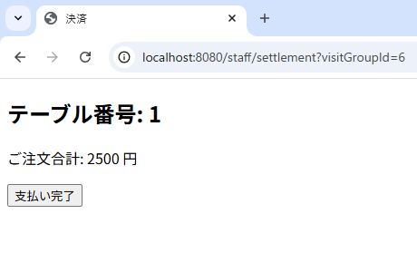

# 居酒屋注文システム

Java + Spring Boot による Web アプリケーションです。  
MVC構造を意識して設計・実装しています。

---

## 🎯 特徴・目的

- Spring Boot を用いた Web アプリケーション開発の一連の流れ（設計 → 実装 → テスト）を実践的に体験することを目的とした自作プロジェクトです。
- 特に「何をどう作るかを自分で決める上流工程」を重視し、設計方針やユーザー導線の明確化に取り組みました。
- お客様にとっては「はじめての人でも直感的に使えるUI」を意識し、モバイル対応とシンプルな操作体系を実現しました。
- 店舗スタッフにとっては「日々の業務をスムーズに行える効率性」を重視し、操作手数を抑えた導線設計と一覧画面の最適化を行いました。
- ユーザーの役割（お客様／スタッフ）に応じたアクセス制御を導入し、QRコードによる簡単なアクセス導線も提供しました。
- また、一部の機能には 単体テスト（JUnit, Mockito）によるテストコード を整備しています。

---

## 🖼️ ER図
  

---

## ⚙️ 主な機能

- お客様側機能
  - カテゴリ別メニュー閲覧
  - 商品詳細表示、カート追加
  - 注文・注文履歴閲覧
- スタッフ側機能
  - グループ来店登録・QRコード発行
  - 注文一覧表示（未提供フィルタあり）
  - グループ別会計処理
  - アクティブグループ管理画面
- その他の共通機能
  - QRコード生成（Google ZXing）
  - 権限管理（Spring Security）
  - MVC構造に基づいた設計（Controller / Service / Repository 分離）

---

## 🧱 技術構成

- Java 17.0.10
- MySQL 8.4.5
- Gradle 8.14.2
- org.springframework.boot:spring-boot:3.5.0
- org.springframework:spring-core:6.2.7
- org.junit.jupiter:junit-jupiter:5.12.2
- org.mockito:mockito-core:5.17.0
- com.google.zxing:core:3.5.2
- com.google.zxing:javase:3.5.2

---

## 📁 ディレクトリ構成（抜粋）

izakayaOrder/  
├── IzakayaOrderApplication.java  // エントリポイント  
├── config/　　　　　　　　　　　 // 認証、初期設定  
├── controller/　　　　　　　　　  
│　　　├── order/ 　　　　　　　  
│　　　└── staff/ 　　　　　　　  
├── model/ 　　　　　　　　　　　  
│　　　├── dto/ 　　　　　　　　  
│　　　└── entity/ 　　　　　　　  
├── repository/ 　　　　　　　　　  
├── service/ 　　　　　　　　　　  
├── enums/ 　　　　　　　　　　　  
└── util/ 　　　　　　　　　　　　  

---

## 🖼️ 画面キャプチャ

  
  

  
  
  
  
  

  
  
  
  
  

  

---

## 📝 ライセンス

このプロジェクトは個人の学習・作品展示目的で公開しており、商用利用はご遠慮ください。
